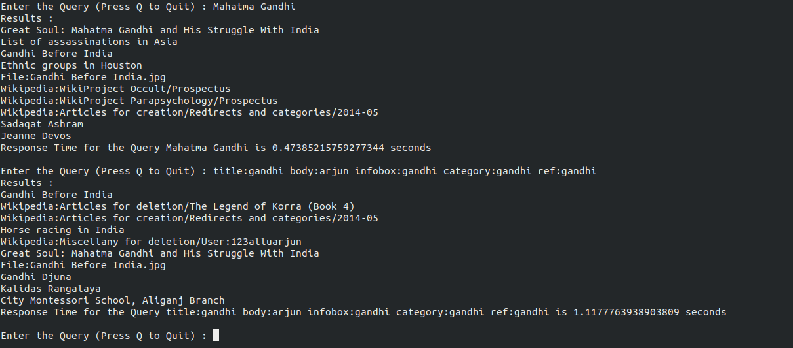

# Wiki-Search-Engine


### [Download Dataset](https://drive.google.com/file/d/1xEdzGHOA_aSCEZYjQHTQcM20qjyHOcV0/view?fbclid=IwAR1bMTZ3352snG9NuzJX2-VVArYZGDeQXv24cPk1AsAja8y6gH1h-chts0o) 
	
* This is a sample 100MB dump data.

### Required Python Libraries : 

* ```xml.sax```
* ```nltk```
* ```Stemmer```

### Objectives : 

Create a complete search engine by creating an Inverted Index on the Wikipedia Corpus ( of 2018 with size 72 GB), that gives you top search result related to given query words.

In this project two types of queries are handles : 

* Simple Queries : Ex. - ```Mahatma Gandhi```
* Multi-field queries : Ex - ```body:Mahatma infobox:xyz ```

The search results are ordered in ranking using a weighted TF-IDF ranking based on occurance of word in Title, Body, InfoBox and so on... 

### How to run : 


* Index Creation :
 ``` python3 index.py <wikipedia_dump_path> <index_path>```

* Search : 
	``` python3 search.py <index_path> ```
	
### Sample results : 



* Posting list corresponding to the query  :


### Implementation Details : 

* The main challenge to create an Inverted Index for a huge file has a tradeoff between the size of Inverted Index and the search time. The main Inverted Index created was around 24.x GB but we create 3 levels of offset files to make sure the index file loaded in the main memory at a time does not exceed 800 MB. 

Following Steps Follows to create Inverted Indexing : 

* Parsing using ```xml.sax``` parser : Need to parse each page , title tag, infobox, body , category etc...
* Tokenization : Tokenize the doc to get each token using regular expression
* Casefolding : Same case words.
* Stop Words Removal : remove stop word which are more frequently occured in a sentences ```nltk.tokenize.wordpunct_tokenize```
* Stemming : get root/base word and store it ```stemmer```
* A documentId to Title list is created at first for easy retrival of results.
* Inverted Index Creation : create words to  Positing list : 
	*  ``` DocumentID : Title Frequency : Body Frequency : infobox frequency : category frequency ```

After performing the above operations we create Intermediate Index files like 0.txt,1.txt,2.txt,... and so on. Once we are done with creating this intermediate file we perform a K-way merge to merge all these intermediate files into a single Index file. Each entry in the big Index file is a word along with its posting list. For quick retrieval of the Title's corresponding to a query I have created a Document ID - Title Mapping which can be loaded into the memory while performing the Search operation.


